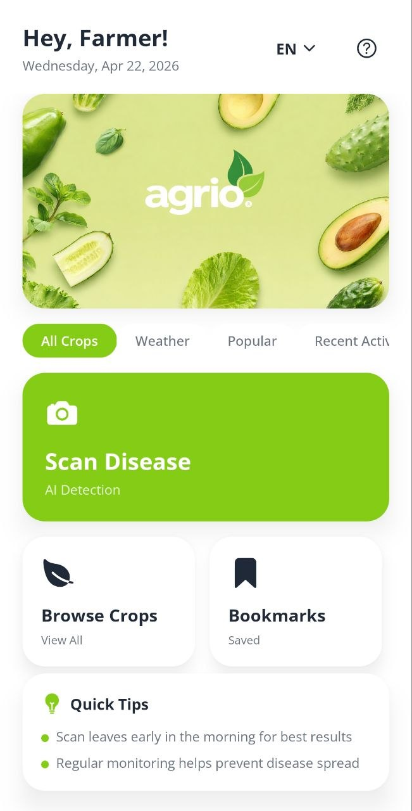
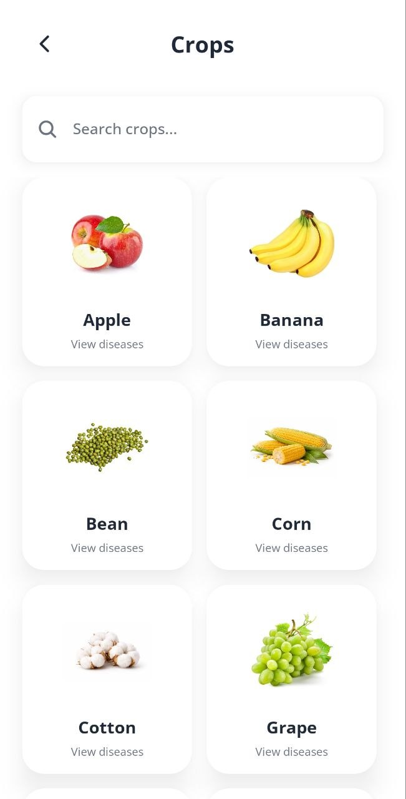
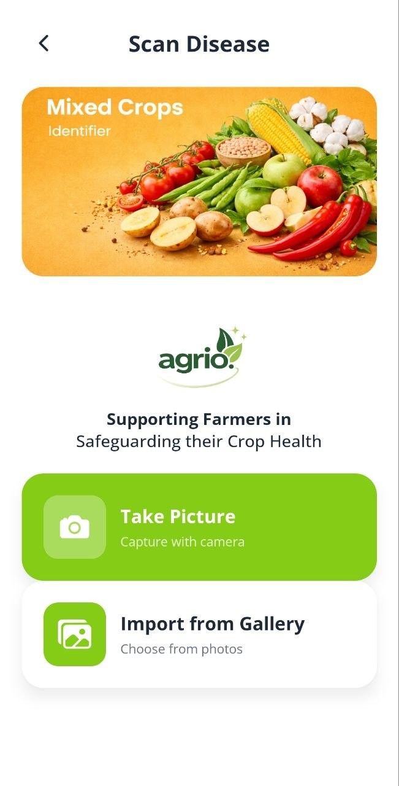

# Agrio – Crop Disease Detection 

[](https://github.com/ChaitanyaChute/Agrio-App/releases/download/v1.0.0/AGRIO.apk)


A smart mobile application for identifying crop diseases using AI/ML. Farmers can capture or upload leaf images to get instant disease identification, treatment recommendations, and preventive measures.

## Screenshots

<p align="center">
  
  &nbsp;&nbsp;
  
  &nbsp;&nbsp;
  
</p>

---
## Features

- **Disease Identification**: Capture or upload leaf images for instant AI-powered disease detection
- **Crop Management**: Browse and manage multiple crop types (Apple, Banana, Bean, Corn, Cotton, Grape, and more)
- **Disease Library**: Comprehensive disease information with symptoms and treatments
- **Weather Integration**: Real-time weather data to support disease prediction
- **Bookmarks**: Save diseases for quick reference
- **Theme Support**: Light and dark mode
- **Multi-Language**: English and Hindi language support
- **Cross-Platform**: Native Android support with iOS ready

## Tech Stack

| Layer | Technology |
|---|---|
| **Framework** | React Native with Expo |
| **Language** | TypeScript |
| **Styling** | NativeWind (Tailwind) |
| **State Management** | React Context API |
| **Storage** | AsyncStorage |
| **HTTP Client** | Axios |

## Project Structure

```
crop-disease-detection/
├── app/
│   ├── _layout.tsx
│   ├── index.tsx                  # Home screen with weather
│   ├── crops.tsx                  # Crop listing screen
│   ├── crop-details.tsx
│   ├── disease.tsx
│   ├── disease-detail.tsx
│   ├── identifier.tsx             # Disease identifier (camera/gallery)
│   ├── bookmarks.tsx
│   ├── settings.tsx
│   ├── config/api.config.ts
│   ├── context/ThemeContext.tsx
│   ├── locales/
│   │   ├── LanguageContext.tsx
│   │   └── translations.ts
│   ├── services/api.service.ts
│   └── utils/
│       ├── fonts.ts
│       └── toastConfig.tsx
├── assets/images/
│   ├── bg/                        # Background images
│   └── crops/                     # Crop icons
├── android/                       # Android native config
├── package.json
├── app.json
├── eas.json
└── .env.example
```

## Getting Started

### Prerequisites

- Node.js (v16 or higher)
- npm or yarn
- Android Studio (for Android development)
- Expo CLI: `npm install -g expo-cli`

### Installation

```bash
# 1. Clone the repository
git clone https://github.com/yourusername/crop-disease-detection.git
cd crop-disease-detection

# 2. Install dependencies
npm install

# 3. Configure environment variables
cp .env.example .env
# Edit .env with your API keys

# 4. Start the development server
npx expo start
```

## Configuration

### Environment Variables

Create a `.env` file in the root directory:

```env
EXPO_PUBLIC_DATA_API_BASE=http://127.0.0.1:5000
EXPO_PUBLIC_ML_API_BASE=http://127.0.0.1:8000
EXPO_PUBLIC_OPENWEATHER_API_KEY=your_api_key_here
```

## Screens Overview

| Screen | Description |
|---|---|
| **Home** | Welcome screen with crop selection and weather widget |
| **Crops** | Browse all available crops |
| **Crop Details** | View crop info and associated diseases |
| **Identifier** | Capture or upload leaf images for disease detection |
| **Disease** | Browse disease database |
| **Disease Detail** | Full disease info, treatments, and prevention |
| **Bookmarks** | View saved/bookmarked diseases |
| **Settings** | Manage theme, language, and app preferences |

## API Endpoints

```
GET  /api/crops              # Get all crops
GET  /api/crops/:id          # Get crop details
GET  /api/diseases           # Get all diseases
GET  /api/diseases/:id       # Get disease details
POST /predict                # Identify disease from image (ML)
```

The app uses two backends:
- **Data API** (Node.js) — crop and disease data
- **ML API** (FastAPI) — image-based disease prediction via `POST /predict`
- **OpenWeatherMap** — real-time weather data
